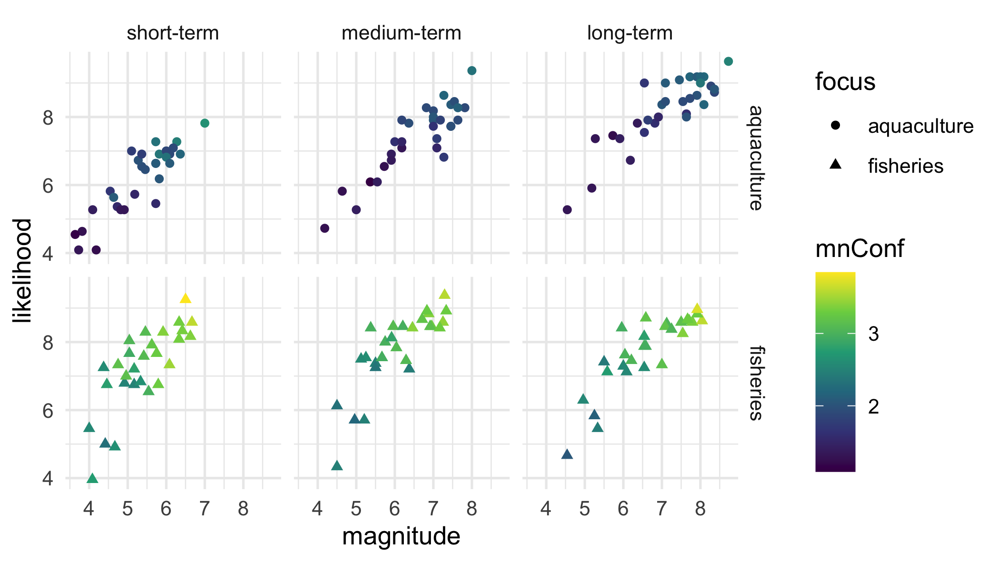
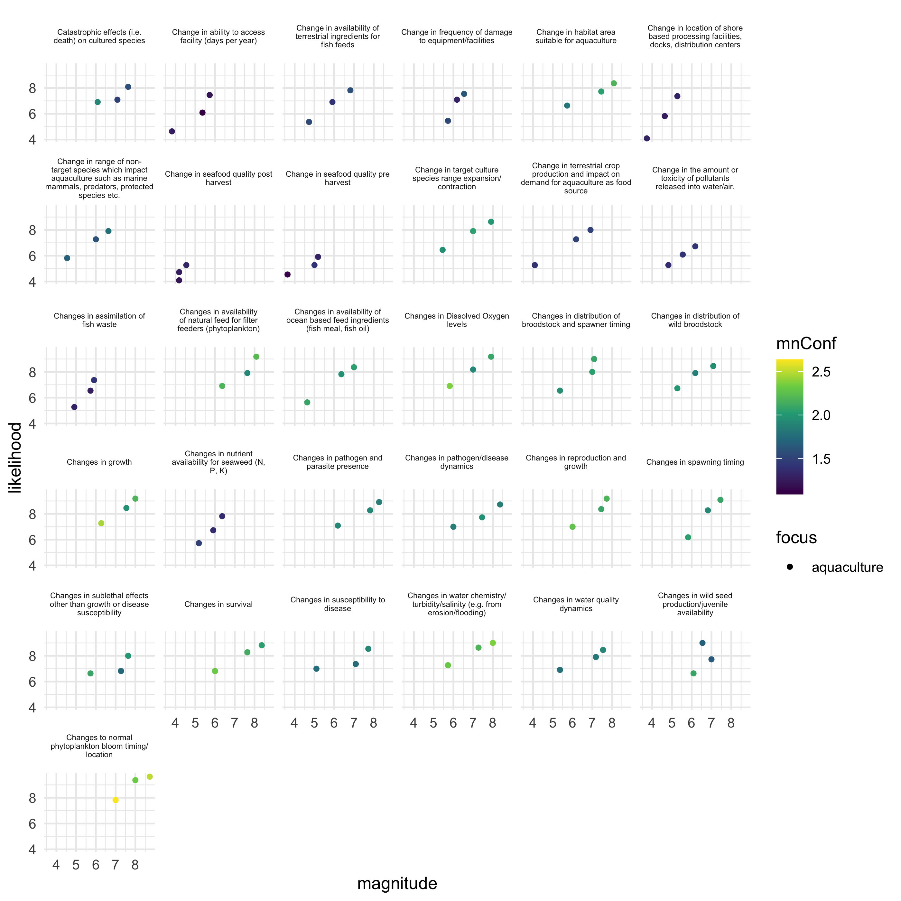
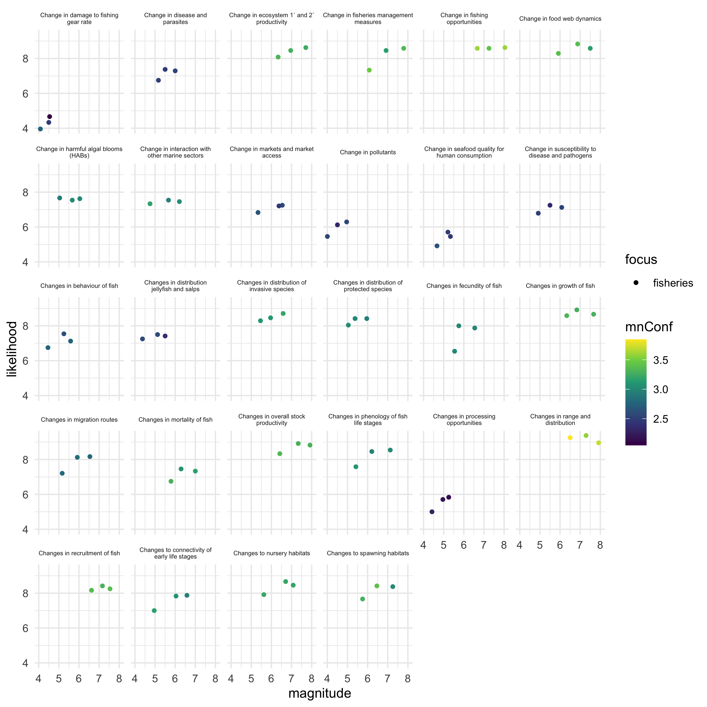

```{r startup, eval=TRUE, echo=FALSE, results='hide',message=FALSE}
 
 #source("R/make.R")       # loads packages, data, setup, etc.
 knitr::opts_chunk$set(echo = T, fig.align="center")
 thisYr <- format(Sys.time(), "%Y")
 today  <- format(Sys.time(), "%b %d, %Y")
 tmstp  <- format(Sys.time(), "%Y_%m_%d")
```


# 1. WKCLIMAD Overview

This repository contains R code and Rdata files for working with WKCLIMAD data and responses. WKCLIMAD is an ICES workshop aimed at exploring how can the short-, medium-, and long-term influences of climate change on aquaculture, fisheries, and ecosystems be accounted for in ICES Advice.

The workshop is chaired by: Mark Dickey-Collas, Kirstin Kari Holsman, and Michael Rust. More information can be found here:https://www.ices.dk/community/groups/Pages/WKCLIMAD.aspx

## Summary:
As managers, policy-makers, and other stakeholders become increasingly aware of the need to consider climate impacts, this workshop will develop a proposal for an operational climate-aware advisory framework. Experts are invited to join WKCLIMAD to review the recent and emergent analyses of key climate hazards to aquaculture, fisheries, and ecosystems.

The workshop will outline actionable strategies and approaches that can be taken to promote resiliency in fisheries, aquaculture, and ecosystems. It will scope the next steps for an operational approach, expanding the relevant aspects of climate change that impact management decisions in fisheries, aquaculture and ecosystems.

The kick off meeting will take place on the 21 June 2021, and participants will work via correspondence prior to the online meetings taking place 29–30 September and 18–20 October 2021.

Registration is now closed. Selected participants will be announced by 15 June 2021.

We expect this to be a popular workshop and therefore may have to limit the number of participants. If the workshop is oversubscribed, ICES reserves the right, in consultation with the workshop chairs, to select the final workshop participants based on their expertise, and equitable makeup of the workshop.


# 2. Code overview

In August 2021 multiple experts provided a rapid assessment of climate impacts via a Delphi approach. The code below analyses the output from that activity and produces the plots and results summarized in the WKCLIMAD report. The code below will generate the following plots:

{width=65%}
{width=100%}

{width=100%}

To generate the plots above run the following code in R (be sure your workspace is within your local `WKCLIMAD` folder):

```{r plotResults, echo=TRUE, eval=F, include =T}

   # getwd()  should return something like:
   # "/Users/kholsman/Documents/GitHub/WKCLIMAD"

   # loads packages, data, setup, etc.
    suppressWarnings(source("R/make.R"))
    
    # reshape the data into long-format:
    # --------------------------------------
    long_a <- getData(aqua_dat)
    long_f <- getData(fish_dat)
    long_a$focus <- "aquaculture"
    long_f$focus <- "fisheries"
    
    # combine into single long format:
    long <- rbind(long_a,long_f)
    
    # summarize across participants:
    smry <- long%>%group_by(focus,category,time_period,type)%>%summarise(
      mn = mean(value.x,na.rm=T),
      sd = sd (value.x,na.rm=T),
      n  = length(value.x),
      median = median(value.x,na.rm=T),
      mn_conf = mean(conf_n,na.rm=T),
      sd_conf = sd(conf_n,na.rm=T),
      median_conf = median(conf_n,na.rm=T))
    smry<-smry%>%mutate(se = sd/sqrt(n))
    smry$type <- factor(smry$type)
    
    # split mag and likelihood into columns:
    smry_w    <- tidyr::spread(smry%>%
                                 select(focus,time_period,category,type, mn), 
                               key = type, value = mn)
    smry_wse    <- tidyr::spread(smry%>%
                                 select(focus,time_period,category,type, se), 
                               key = type, value = se)
    smry_wse    <- smry_wse%>%rename(likelihoodSE=likelihood,magnitudeSE=magnitude)
    smry_w <- merge(smry_w,smry_wse,
                    by=c("focus","time_period","category"))
    smry_conf <- tidyr::spread(smry%>%
                                 select(focus,time_period,category,type, mn_conf), 
                               key = type, value = mn_conf)
    smry_conf$mnConf <- apply(smry_conf[,c("likelihood","magnitude")],1,mean)
    
    smry_w <- merge(smry_w, smry_conf%>%
                      select(focus,time_period,category, mnConf),
                    by=c("focus","time_period","category"))
   
    smry_w$category <- gsub("Change in ", "", smry_w$category)
    smry_w$category <- gsub("Changes in ", "", smry_w$category)
    smry_w$category <- gsub("Changes to ", "", smry_w$category)
    smry_w$cat_wrap <- stringr::str_wrap(smry_w$category, width=30)
    mult<-1.95
    smry_w$ylower <- smry_w$likelihood-mult*smry_w$likelihoodSE
    smry_w$yupper <- smry_w$likelihood+mult*smry_w$likelihoodSE
    smry_w$xlower <- smry_w$magnitude-mult*smry_w$magnitudeSE
    smry_w$xupper <- smry_w$magnitude+mult*smry_w$magnitudeSE
  
    
    smry_w$confidence   <- smry_w$mnConf
    smry_w$uncertainty  <- smry_w$mnConf^-1
    smry_w$focus        <- factor(smry_w$focus,levels=c("fisheries","aquaculture"))
    aqua <- smry_w%>%filter(focus=="aquaculture")
    fish <- smry_w%>%filter(focus=="fisheries")
    
    
  # now make some plots:
    
    #all points together
   p <-  ggplot()+geom_point(data=smry_w,aes(x     = magnitude,
                                             y     = likelihood,
                                             color = confidence,
                                             shape = focus))+
      scale_color_viridis_c()+
      facet_grid(focus~time_period)+theme_minimal()
     
    sclr <-.75
    png("Figs/Fig1_all_byTimeFrame.png", width = 8*sclr, height = 4.5*sclr, units = "in",res = 350)
    print(p)
    dev.off()
   
    # all points together for fisheries
    p_fish<-  ggplot()+geom_point(data=smry_w%>%filter(focus=="fisheries"),
                                   aes(x     = magnitude,
                                             y     = likelihood,
                                             color = confidence),shape=16)+
      scale_color_viridis_c()+
      facet_grid(focus~time_period)+theme_minimal()
    
    p_aqua <-  ggplot()+geom_point(data=smry_w%>%filter(focus=="aquaculture"),
                                   aes(x     = magnitude,
                                             y     = likelihood,
                                             color = confidence),shape=17)+
      scale_color_viridis_c()+
      facet_grid(focus~time_period)+theme_minimal()
    
    
    # Now the top set for each focus:
    #-------------------------------------------------
    sub <- smry_w%>%filter(focus=="aquaculture",time_period=="long-term")
    cc <- which(sub$likelihood>quantile(sub$likelihood)[4]&sub$magnitude>quantile(sub$magnitude)[4])
    highest_aqua <- aqua[which(aqua$category%in%sub[cc,]$category),]
    
    sub  <- smry_w%>%filter(focus=="fisheries",time_period=="long-term")
    cc   <- which(sub$likelihood>quantile(sub$likelihood)[4]&sub$magnitude>quantile(sub$magnitude)[4])
    highest_fish <- fish[which(fish$category%in%sub[cc,]$category),]

    p_top_fish <- ggplot()+geom_point(data=highest_fish,
                            aes(x=magnitude,y=likelihood,color=confidence,shape=time_period))+
      scale_color_viridis_c()+
      facet_wrap(.~cat_wrap,nrow=2)+theme_minimal()+ theme(strip.text = element_text(size = 5))+
      xlim(0, 10) +ylim(0,10)+ theme(axis.text.x = element_text(angle = 90, vjust = 0.5, hjust=1))
    
    sclr <-1
    png("Figs/top_fish.png", width = 6*sclr, height = 3*sclr, units = "in",res = 350)
    print(p_top_fish)
    dev.off()
    
    p_top_aqua <- ggplot()+geom_point(data=highest_aqua,
                            aes(x=magnitude,y=likelihood,color=confidence,shape=time_period))+
      scale_color_viridis_c()+
      facet_wrap(.~cat_wrap,nrow=2)+theme_minimal()+ theme(strip.text = element_text(size = 5))+
      xlim(0, 10) +ylim(0,10)+ theme(axis.text.x = element_text(angle = 90, vjust = 0.5, hjust=1))

    png("Figs/top_aqua.png", width = 4.5*sclr, height = 3*sclr, units = "in",res = 350)
    print(p_top_aqua)
    dev.off()
      
  
    # now plot the top five most variable (based on SE)
    #-------------------------------------------------
    sub <- aqua #%>%filter(time_period=="long-term")
    cc  <- which(sub$likelihoodSE>quantile(sub$likelihoodSE)[4]&sub$magnitudeSE>quantile(sub$magnitudeSE)[4])
    highest_aquaSE <- aqua[which(aqua$category%in%sub[cc,]$category),]
    
    sub  <- fish#%>%filter(time_period=="long-term")
    cc   <- which(sub$likelihoodSE>quantile(sub$likelihoodSE)[4]&sub$magnitudeSE>quantile(sub$magnitudeSE)[4])
    highest_fishSE <- fish[which(fish$category%in%sub[cc,]$category),]
    
    # plot the top set of fisheries 
    p_top_fishSE <- ggplot(data=highest_fishSE)+
      geom_point(aes(x=magnitude,y=likelihood,color=confidence,shape=time_period))+
      geom_linerange(aes(x=magnitude,y=likelihood,color=confidence,ymin = ylower, ymax = yupper))+
      geom_errorbarh(aes(x=magnitude,y=likelihood,color=confidence,xmin = xlower,xmax = xupper))+
      scale_color_viridis_c()+
      facet_wrap(.~cat_wrap,nrow=2)+theme_minimal()+ theme(strip.text = element_text(size = 5))+
      xlim(0, 10) +ylim(0,10)+ theme(axis.text.x = element_text(angle = 90, vjust = 0.5, hjust=1))
    
    sclr <-1
    png("Figs/top_fish_var.png", width = 6*sclr, height = 3*sclr, units = "in",res = 350)
    print(p_top_fishSE)
    dev.off()
    
     # plot the top set of aquaculture 
    p_top_aquaSE <- ggplot(data=highest_aquaSE)+
      geom_point(aes(x=magnitude,y=likelihood,color=confidence,shape=time_period))+
      geom_linerange(aes(x=magnitude,y=likelihood,color=confidence,ymin = ylower, ymax = yupper))+
      geom_errorbarh(aes(x=magnitude,y=likelihood,color=confidence,xmin = xlower,xmax = xupper))+
      scale_color_viridis_c()+
      facet_wrap(.~cat_wrap,nrow=2)+theme_minimal()+ theme(strip.text = element_text(size = 5))+
      xlim(0, 10) +ylim(0,10)+ theme(axis.text.x = element_text(angle = 90, vjust = 0.5, hjust=1))

    png("Figs/top_aqua_var.png", width = 7*sclr, height = 3*sclr, units = "in",res = 350)
    print(p_top_aquaSE)
    dev.off()
      
      
      
    # p_aqua_txt <- p_aqua + geom_text(data=sub,aes(x = magnitude,
    #                                          y     = likelihood,
    #                                          label = cat_wrap,
    #                                          color = confidence))
    # geom_text(data=smry_w,aes(x=magnitude,y=likelihood,color=mnConf,shape=focus)
    sclr <-.75
    png("Figs/Fig1a_aqua_byTimeFrame.png", width = 8*sclr, height = 3*sclr, units = "in",res = 350)
    print(p_aqua)
    dev.off()
    png("Figs/Fig1b_fish_byTimeFrame.png", width = 8*sclr, height = 3*sclr, units = "in",res = 350)
    print(p_fish)
    dev.off()
    
    p2_aqua <- ggplot()+geom_point(data=smry_w%>%filter(focus=="aquaculture"),
                            aes(x=magnitude,y=likelihood,color=confidence,shape=time_period))+
      scale_color_viridis_c()+
      facet_wrap(.~cat_wrap)+theme_minimal()+ theme(strip.text = element_text(size = 5))
       
    png("Figs/plot_all_aqua.png", width = 8, height =8, units = "in",res = 350)
    print(p2_aqua)
    dev.off()
    
    p2_fish <- ggplot()+geom_point(data=smry_w%>%filter(focus=="fisheries"),
                            aes(x=magnitude,y=likelihood,color=confidence,shape=time_period))+
      scale_color_viridis_c()+
      facet_wrap(.~cat_wrap)+theme_minimal()+ theme(strip.text = element_text(size = 5))
    png("Figs/plot_all_fish.png", width = 8, height =8, units = "in",res = 350)
    print(p2_fish)
    dev.off()

   
     #same plot with confidence as size of "+"
     p2_fish_SD<- ggplot(data=smry_w%>%filter(focus=="fisheries"))+
       geom_point(aes(x=magnitude,y=likelihood,color=confidence,shape=time_period))+
        geom_linerange(aes(x=magnitude,y=likelihood,color=confidence,ymin = ylower, ymax = yupper))+
       geom_errorbarh(aes(x=magnitude,y=likelihood,color=confidence,xmin = xlower,xmax = xupper))+
      scale_color_viridis_c()+
      facet_wrap(.~cat_wrap)+theme_minimal()+ theme(strip.text = element_text(size = 5))
    png("Figs/plot_all_fish_SE.png", width = 8, height =8, units = "in",res = 350)
    print(p2_fish_SD)
    dev.off()
    
    #same plot with confidence as size of "+"
     p2_aqua_SD<- ggplot(data=smry_w%>%filter(focus=="aquaculture"))+
       geom_point(aes(x=magnitude,y=likelihood,color=confidence,shape=time_period))+
        geom_linerange(aes(x=magnitude,y=likelihood,color=confidence,ymin = ylower, ymax = yupper))+
       geom_errorbarh(aes(x=magnitude,y=likelihood,color=confidence,xmin = xlower,xmax = xupper))+
      scale_color_viridis_c()+
      facet_wrap(.~cat_wrap)+theme_minimal()+ theme(strip.text = element_text(size = 5))
    png("Figs/plot_all_aqua_SE.png", width = 8, height =8, units = "in",res = 350)
    print(p2_aqua_SD)
    dev.off()
    
    write.csv(file="Data/out/aquaculture_cats.csv",
              unique(smry_w%>%filter(focus=="aquaculture")%>%select(category)))
    write.csv(file="Data/out/fishery_cats.csv",
              unique(smry_w%>%filter(focus=="fisheries")%>%select(category)))
   
   write.csv(file="Data/out/fishery.csv",fish)
   write.csv(file="Data/out/aquaculture.csv",aqua)
   # add type (and range)
 
```


```{r makeReadME, echo=FALSE,eval=F, include =F}

 # copy and paste this into R window (won't work within markdown)
 rmd2md(rmd_fl = "WKCLIMAD_getStarted",md_fl = "README")

```


