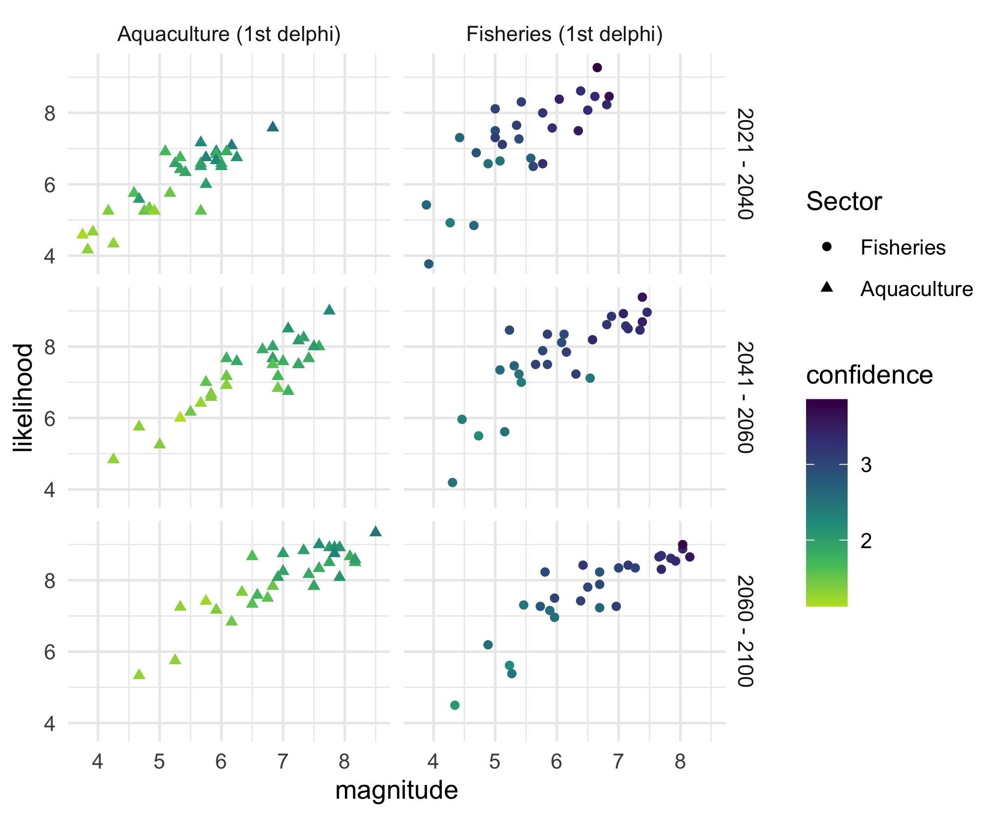
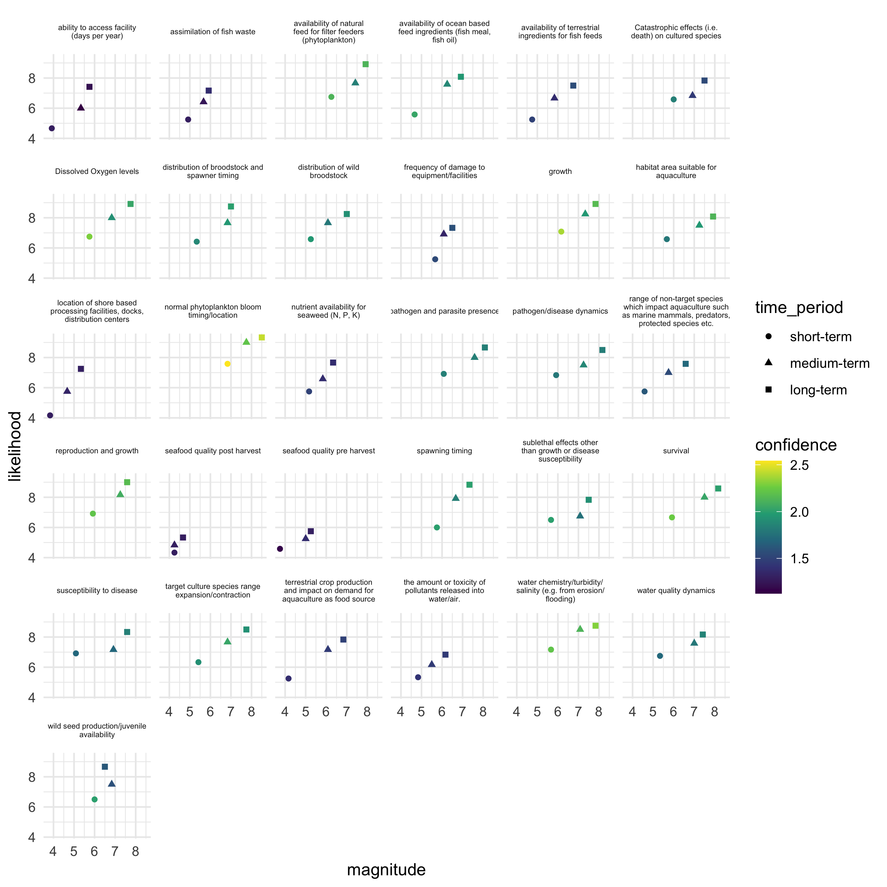
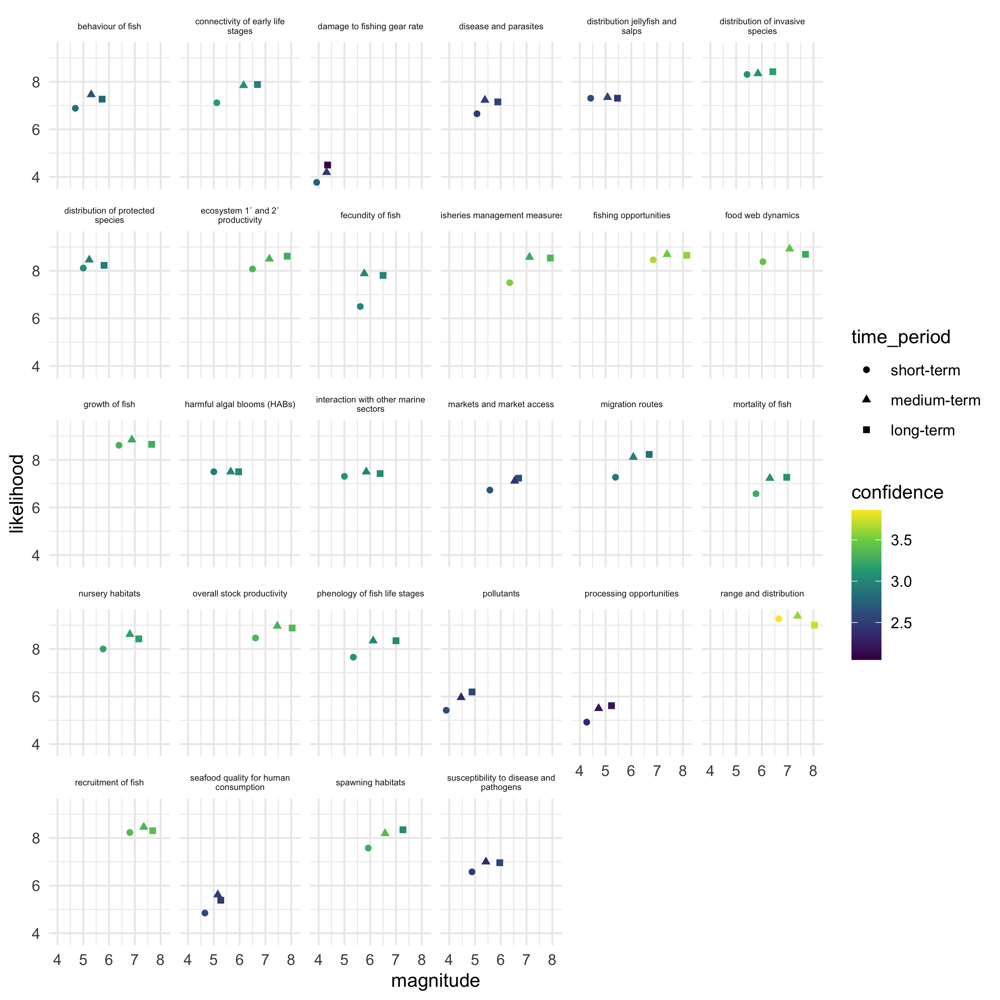
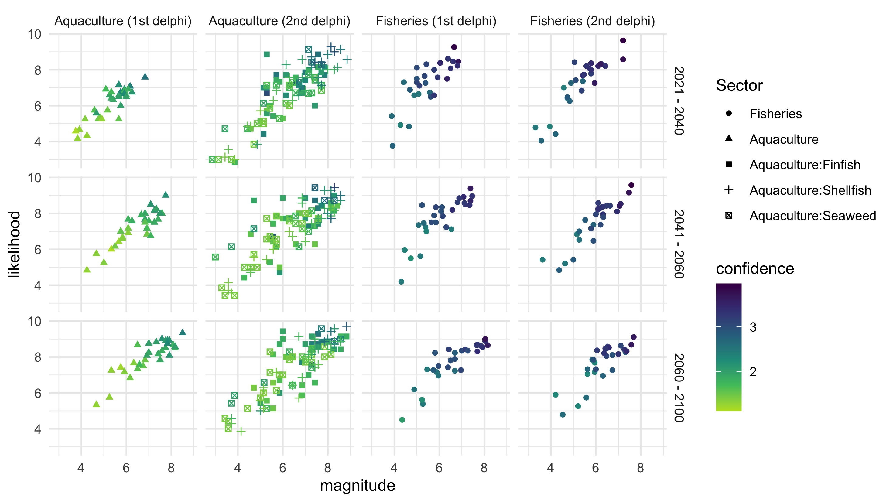

```{r startup, eval=TRUE, echo=FALSE, results='hide',message=FALSE}
 
 #source("R/make.R")       # loads packages, data, setup, etc.
 knitr::opts_chunk$set(echo = T, fig.align="center")
 thisYr <- format(Sys.time(), "%Y")
 today  <- format(Sys.time(), "%b %d, %Y")
 tmstp  <- format(Sys.time(), "%Y_%m_%d")
```


# 1. WKCLIMAD Overview

This repository contains R code and Rdata files for working with WKCLIMAD data and responses. WKCLIMAD is an ICES workshop aimed at exploring how can the short-, medium-, and long-term influences of climate change on aquaculture, fisheries, and ecosystems be accounted for in ICES Advice.

More information about WKCLIMAD can be found here:https://www.ices.dk/community/groups/Pages/WKCLIMAD.aspx

## Summary:
As managers, policy-makers, and other stakeholders become increasingly aware of the need to consider climate impacts, this workshop will develop a proposal for an operational climate-aware advisory framework. Experts are invited to join WKCLIMAD to review the recent and emergent analyses of key climate hazards to aquaculture, fisheries, and ecosystems.

The workshop will outline actionable strategies and approaches that can be taken to promote resiliency in fisheries, aquaculture, and ecosystems. It will scope the next steps for an operational approach, expanding the relevant aspects of climate change that impact management decisions in fisheries, aquaculture and ecosystems.

The kick off meeting will take place on the 21 June 2021, and participants will work via correspondence prior to the online meetings taking place 29–30 September and 18–20 October 2021.

Registration is now closed. Selected participants will be announced by 15 June 2021.

We expect this to be a popular workshop and therefore may have to limit the number of participants. If the workshop is oversubscribed, ICES reserves the right, in consultation with the workshop chairs, to select the final workshop participants based on their expertise, and equitable makeup of the workshop.


# 2. Code overview

In August 2021 multiple experts provided a rapid assessment of climate impacts via a Delphi approach. The code below analyses the output from that activity and produces the plots and results summarized in the WKCLIMAD report. The code below will generate the following plots:

{width=65%}


<!-- {width=100%} -->


<!-- {width=100%} -->

To generate the plots above run the following code in R (be sure your workspace is within your local `WKCLIMAD` folder):

```{r summarizeResults, echo=TRUE, eval=TRUE, include =T,results='hide',message=FALSE}

   # getwd()  should return something like:
   # "/Users/username/Documents/GitHub/WKCLIMAD"

   # loads packages, data, setup, etc.
    suppressWarnings(source("R/make.R"))
    
    # reshape the data into long-format:
    # --------------------------------------
    long_a <- getData_Impacts(aqua_dat,
                     LM  = c("likelihood","magnitude"),
                    time_period  = c("2021 - 2040", "2041 - 2060", "2060 - 2100"),
                    Sector  = c("Aquaculture"),
                    lvls  = c("Low  - My opinion",
                              "Medium low - My opinion and some data",
                              "Medium - Some data and publications by others",
                              "Medium High - My own data, and publications by others",
                              "High - My own data and publications"),
                    rmMeanScore = F, 
                    splitIN = "\t",
                    adjIN = 0)
                    
    long_f <- getData_Impacts(fish_dat,
                    LM  = c("likelihood","magnitude"),
                    time_period  = c("2021 - 2040", "2041 - 2060", "2060 - 2100"),
                    Sector  = c("Fisheries"),
                    lvls  = c("Low  - My opinion",
                              "Medium low - My opinion and some data",
                              "Medium - Some data and publications by others",
                              "Medium High - My own data, and publications by others",
                              "High - My own data and publications"),
                    rmMeanScore = F, 
                    splitIN = "\t",
                    adjIN = 0)
    
    # round 2 data:
    long_a2 <- getData_Impacts(aqua2_dat,
                    LM  = c("likelihood","magnitude"),
                    time_period  = c("2021 - 2040", "2041 - 2060", "2060 - 2100"),
                    Sector  = c("Aquaculture:Finfish",
                              "Aquaculture:Shellfish",
                              "Aquaculture:Seaweed"),
                    lvls  = c("Low  - My opinion",
                              "Medium low - My opinion and some data",
                              "Medium - Some data and publications by others",
                              "Medium High - My own data, and publications by others",
                              "High - My own data and publications"),
                    rmMeanScore = T, 
                    splitIN = "\t",
                    adjIN = 0)
    
    # check that values match:
    # long_a2%>%filter(Email == "Mike.rust@noaa.gov",category == "Changes in Spawning timing")
    
    
    long_f2 <- getData_Impacts(datIN = fish2_dat,
                    LM  = c("likelihood","magnitude"),
                    time_period  = c("2021 - 2040", "2041 - 2060", "2060 - 2100"),
                    Sector  = c("Fisheries"),
                    lvls  = c("Low  - My opinion",
                              "Medium low - My opinion and some data",
                              "Medium - Some data and publications by others",
                              "Medium High - My own data, and publications by others",
                              "High - My own data and publications"),
                    rmMeanScore = T, 
                    splitIN = "Mean Score",
                    adjIN = 1)
    
    
    # mitigation and adaptation
    long_adapt_fish   <- getData_adapt(adapt_fish,
                                       lkupIN = adapt_fish_lkup,
                                       LM  = c("likelihood","magnitude"),
                                       lvls  = c("Low  - My opinion",
                                                  "Medium low - My opinion and some data",
                                                  "Medium - Some data and publications by others",
                                                  "Medium High - My own data, and publications by others",
                                                  "High - My own data and publications"),
                                       adjIN = 4)
    long_adapt_aqua   <- getData_adapt(adapt_aqua,
                                       lkupIN = adapt_aqua_lkup,
                                       LM  = c("likelihood","magnitude"),
                                       lvls  = c("Low  - My opinion",
                                                  "Medium low - My opinion and some data",
                                                  "Medium - Some data and publications by others",
                                                  "Medium High - My own data, and publications by others",
                                                  "High - My own data and publications"),
                                       adjIN = 4)
    
     # combine into single long format:
    long       <- rbind(long_a,long_f)
    long_adapt <- rbind(long_adapt_aqua,long_adapt_fish)
    
    ## Feb 2022 - pick up here
    long_mitigat2     <- getData_adapt(datIN  = mitigat_dat,
                                       lkupIN = mitigat_lkup,
                                       LM  = c("likelihood","magnitude"),
                                       lvls  = c("Low  - My opinion",
                                                  "Medium low - My opinion and some data",
                                                  "Medium - Some data and publications by others",
                                                  "Medium High - My own data, and publications by others",
                                                  "High - My own data and publications"),
                                       adjIN = 4)
    
    # get summaries:
    smry_f1i <- get_smry_impacts(dat = long_f,
                                 focus   = "Fisheries",
                                 Sector2 = "Fisheries (1st delphi)", mult = 1.95)
    smry_a1i <- get_smry_impacts(dat = long_a,
                                 focus   = "Aquaculture",
                                 Sector2 = "Aquaculture (1st delphi)", mult = 1.95)
    smry_f2i <- get_smry_impacts(dat = long_f2,
                                 focus   = "Fisheries",
                                 Sector2 = "Fisheries (2nd delphi)", mult = 1.95)
    smry_a2i <- get_smry_impacts(dat = long_a2,
                                 focus   = "Aquaculture",
                                 Sector2 = "Aquaculture (2nd delphi)", mult = 1.95)
    #smry of impacts
    smry_i <- rbind(smry_f1i,smry_a1i,smry_f2i,smry_a2i)
   
    
      # get summaries:
    smry_fish_adapt <- get_smry_adapt_mit(dat = long_adapt_fish,
                                 focus   = "Fisheries",
                                 Sector2 = "Fisheries Adaptation", mult = 1.95)
    
     smry_aqua_adapt <- get_smry_adapt_mit(dat = long_adapt_aqua,
                                 focus   = "Aquaculture",
                                 Sector2 = "Aquaculture Adaptation", mult = 1.95)
     
     smry_mitigat <- get_smry_adapt_mit(dat = long_mitigat2,
                                 focus   = "Mitigation",
                                 Sector2 = "Fish. & Aqua. Mitigation", mult = 1.95)
    smry_am <- rbind(smry_fish_adapt,smry_aqua_adapt,smry_mitigat)
    
    smry_am$Sector2 <- factor(smry_am$Sector2,
                             levels = c("Fisheries Adaptation",
                                        "Aquaculture Adaptation",
                                        "Fish. & Aqua. Mitigation"))
    
    write.table(smry_am,file="Data/out/Adapt_mitigat_summary.csv",sep = ",",row.names = FALSE, qmethod = "double")
    write.table(smry_i,file="Data/out/Impacts_summary.csv",sep = ",",row.names = FALSE, qmethod = "double")
    write.table(file="Data/out/aquaculture_cats.csv",
              unique(smry_i%>%filter(focus=="Aquaculture")%>%select(Category)),
              sep = ",",row.names = FALSE,  qmethod = "double")
   write.table(file="Data/out/fishery_cats.csv",
              unique(smry_i%>%filter(focus=="Fisheries")%>%select(Category)),
              sep = ",",row.names = FALSE,  qmethod = "double")

   # write.csv(file="Data/out/fishery.csv",fish)
   # write.csv(file="Data/out/aquaculture.csv",aqua)
```
  


# Now to make some plots:




```{r plotResults, echo=T, eval=T, include =T,results='hide',message=FALSE}
    
  # now make some plots:
  
    #all points together
   p <-  ggplot()+geom_point(data=smry_i,aes(x     = magnitude,
                                             y     = likelihood,
                                             color = confidence,
                                             shape = Sector))+
      scale_color_viridis_c(begin=.9,end = 0)+
      facet_grid(time_period~Sector2)+theme_minimal()
     
    sclr <-1.05
    png("Figs/Fig1_impacts.png", 
        width = 8*sclr, height = 4.5*sclr, units = "in",res = 350)
    print(p)
    dev.off()
    
   
      #all points together%>%filter(Sector2%in%c("Fisheries Adaptation","Aquaculture Adaptation")),
   p_am <-  ggplot()+geom_point(data=smry_am,
                                aes(x     = magnitude,
                                    y     = likelihood,
                                    color = confidence,
                                    shape = Group))+
     scale_color_viridis_c(begin=.9,end = 0)+
     scale_shape_manual(values = shp_str[c(1,4,7:12)])+
     facet_grid(Sector2~.)+theme_minimal()
     
    sclr <-1.1
    png("Figs/Fig1_adaptmitg.png", 
        width = 5*sclr, height = 5*sclr, units = "in",res = 350)
    print(p_am)
    dev.off()
    
    
     #First only points together
   p1 <-  ggplot()+geom_point(data=smry_i%>%
                               filter(Sector2%in%
                                        c("Fisheries (1st delphi)" , 
                                          "Aquaculture (1st delphi)")),
                             aes(x     = magnitude,
                                             y     = likelihood,
                                             color = confidence,
                                             shape = Sector))+
      scale_color_viridis_c(begin=.9,end = 0)+
      facet_grid(time_period~Sector2)+theme_minimal()
   p2 <-  ggplot()+geom_point(data=smry_i%>%
                               filter(Sector2%in%
                                        c("Fisheries (2nd delphi)",
                                          "Aquaculture (2nd delphi)")),
                             aes(x     = magnitude,
                                             y     = likelihood,
                                             color = confidence,
                                             shape = Sector))+
      scale_color_viridis_c(begin=.9,end = 0)+
      facet_grid(time_period~Sector2)+theme_minimal()
     
    sclr <-1.05
    png("Figs/Fig1_impacts_1stdephi.png", 
        width = 5.5*sclr, height = 4.5*sclr, units = "in",res = 350)
    print(p1)
    dev.off()
     png("Figs/Fig1_impacts_2nddephi.png", 
        width = 6*sclr, height = 4.5*sclr, units = "in",res = 350)
    print(p2)
    dev.off()
    
    p_fish <- ggplot()+geom_point(data=smry_i%>%
                               filter(focus=="Fisheries"),
                             aes(x     = magnitude,
                                             y     = likelihood,
                                             color = confidence,
                                             shape = Sector))+
      scale_color_viridis_c(begin=.9,end = 0)+
      facet_grid(time_period~Sector2)+theme_minimal()
    
    p_aqua<- ggplot()+geom_point(data=smry_i%>%
                               filter(focus=="Aquaculture"),
                             aes(x     = magnitude,
                                             y     = likelihood,
                                             color = confidence,
                                             shape = Sector))+
      scale_color_viridis_c(begin=.9,end = 0)+
      facet_grid(time_period~Sector2)+theme_minimal()
   
     
    sclr <-1.05
    png("Figs/Fig1_impacts_fish.png", 
        width = 5.5*sclr, height = 4.5*sclr, units = "in",res = 350)
    print(p_fish)
    dev.off()
     png("Figs/Fig1_impacts_aqua.png", 
        width = 6*sclr, height = 4.5*sclr, units = "in",res = 350)
    print(p_aqua)
    dev.off()
  
p_eachC_fish <- ggplot()+
  geom_point(data=smry_i%>%filter(focus=="Fisheries", Sector2 == "Fisheries (1st delphi)"),
                                  aes(x=magnitude,
                                      y=likelihood,
                                      color=confidence,
                                      shape=time_period),alpha = .3)+
  geom_point(data=smry_i%>%filter(focus=="Fisheries", Sector2 == "Fisheries (2nd delphi)"),
                                  aes(x=magnitude,
                                      y=likelihood,
                                      color=confidence,
                                      shape=time_period),alpha = 1)+
  scale_color_viridis_c(begin=.9,end = 0)+
  facet_wrap(.~cat_wrap,nrow=4)+
  theme_minimal()+ 
  theme(strip.text = element_text(size = 5))+
  xlim(0, 10) +ylim(0,10)+ 
  theme(axis.text.x = element_text(angle = 90, vjust = 0.5, hjust=1))


    sclr <-1.5
png("Figs/each_impacts_fish.png", 
    width = 6*sclr, height = 3*sclr, units = "in",res = 350)
print(p_eachC_fish)
dev.off()
   # add type (and range)


 
p_eachC_aqua <- ggplot()+
  # geom_point(data=smry_i%>%filter(focus=="Aquaculture", Sector2 == "Aquaculture (1st delphi)"),
  #                                 aes(x=magnitude,
  #                                     y=likelihood,
  #                                     color=confidence,
  #                                     shape=time_period),alpha = .3)+
  geom_point(data=smry_i%>%filter(focus=="Aquaculture", Sector2 == "Aquaculture (2nd delphi)"),
                                  aes(x=magnitude,
                                      y=likelihood,
                                      color=confidence,
                                      shape=time_period),alpha = 1)+
  scale_color_viridis_c(begin=.9,end = 0)+
  facet_grid(Sector~cat_wrap)+
  theme_minimal()+ 
  theme(strip.text = element_text(size = 5))+
  xlim(0, 10) +ylim(0,10)+ 
  theme(axis.text.x = element_text(angle = 90, vjust = 0.5, hjust=1))


    sclr <-1.5
png("Figs/each_impacts_aqua.png", 
    width = 6*sclr, height = 3*sclr, units = "in",res = 350)
print(p_eachC_aqua)
dev.off()

```


```{r makeReadME, echo=FALSE,eval=F, include =F}

 # copy and paste this into R window (won't work within markdown)
 rmd2md(rmd_fl = "WKCLIMAD_getStarted",md_fl = "README")

```


